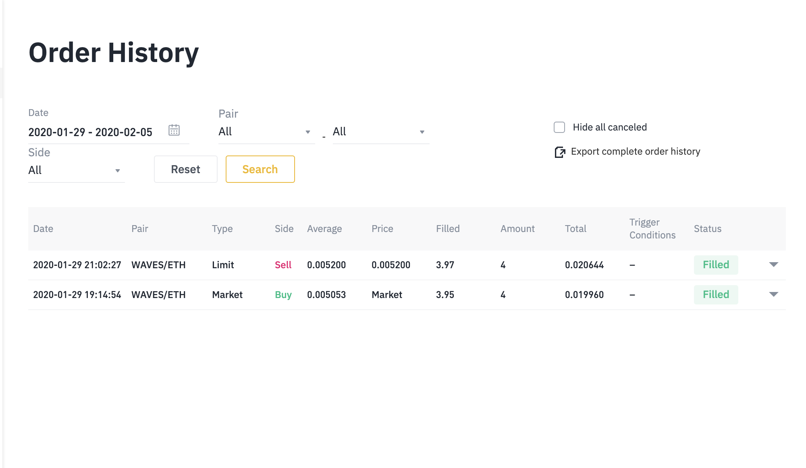

# Algorithmic Trading: Creating Strategies & Placing Orders

This folder contains the source code written in this [video](https://youtu.be/ks-7Lw_b3NI).

## Description

In order to provide you with a template to code your own strategies (and indicators), we will compute the [Ichimoku cloud](https://school.stockcharts.com/doku.php?id=trading_strategies:ichimoku_cloud) (a set of indicators that can act as a standalone trading system) and write a simple strategy using it. Follow the same steps to implement your own strategy!

I restructured the code a bit, separating computing the indicators from the TradingModel. I also inplemented the function that allows you to run the strategies live and we placed the first order - live from our bot, which we exited with a 3% profit in less than 2 hours!



## Creating a Strategy Template

#### Step 1 
Select one or more indicators for your strategy.

#### Step 2 
Import the indicators in the Indicators clas.

###### Indicator already exists in a library
Import it from an external library and add it in the INDICATORS_DICT.

###### Indicator doesn't exist 
Code the function that computes the indicator and add that function to the INDICATORS_DICT.

Here you will have to accomodate for each indicator, depending on how many new columns it will add to the dataframe.

#### Step 3
Code the strategy in the Strategies class, using the same template as with the other strategies. Make sure you will add the indicators that are needed for this strategy to the dataframe if they are absent.

#### Step 4
Add a new StrategyEvaluator using your newly created strategy in the strategy_evaluators dict within TradingBot.py.

#### Step 5 
Backtest and adjust it using different parameters and when you're ready, make it go live!

## Requirements

Have [python 3](https://www.python.org/downloads/) and [pip](https://stackoverflow.com/a/6587528/4468246) installed. 

Install [pyti](https://pypi.org/project/pyti/) for the technical indicators.
``` pip install pyti ```

Install [plotly](https://plot.ly/python/getting-started/) for plotting.
``` pip install plotly ```

Have a Binance account or [create one](https://www.binance.com/?ref=10961872) (10% OFF for trading fees)

Create an API Key on your Binance account.

## Contact 

Do you have a strategy that you want to implement in an algorithm?
Send me an email: hello@tudorbarbulescu.com
